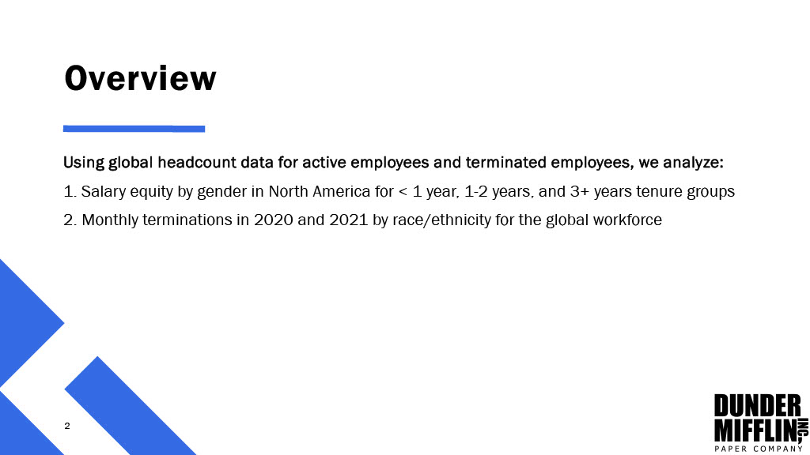
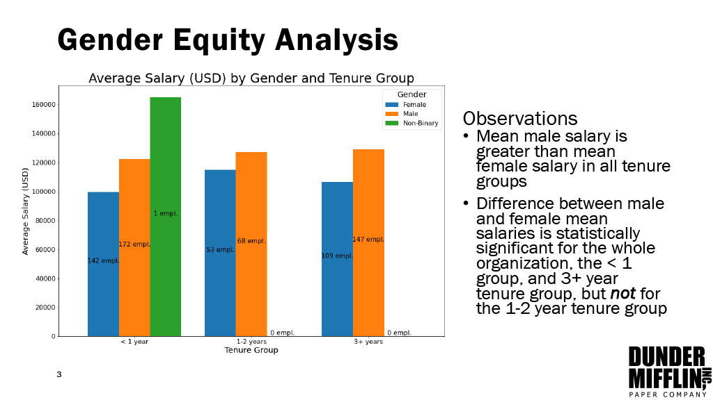
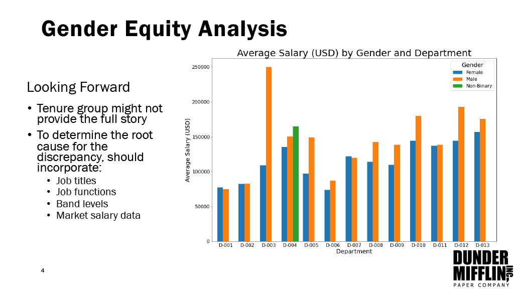
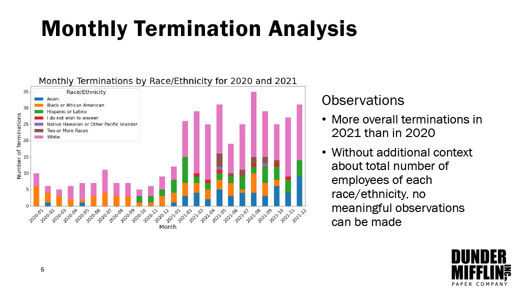
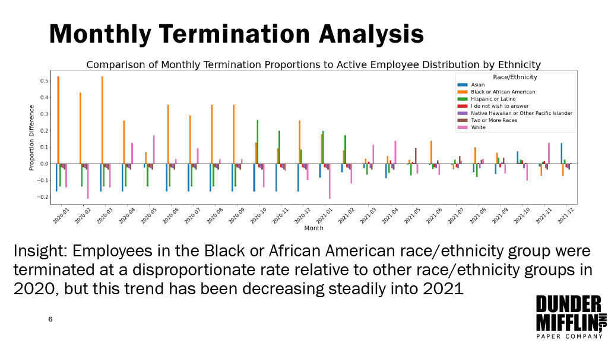
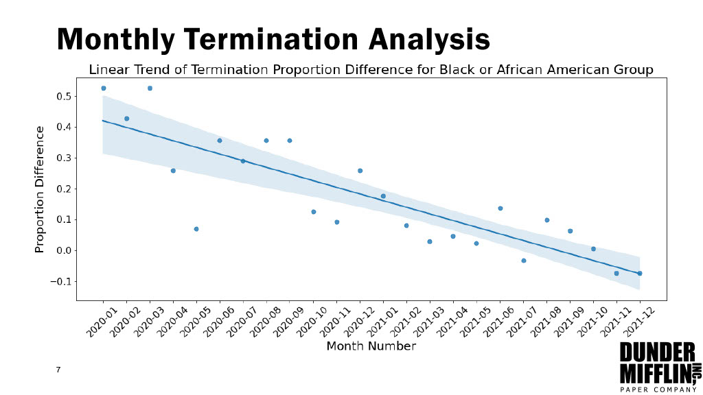
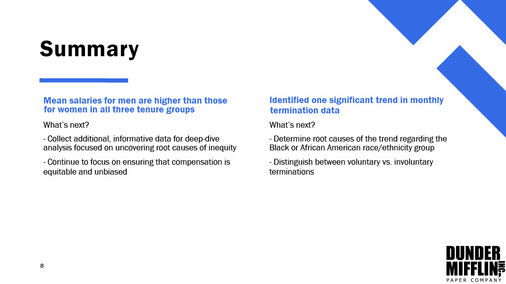

# DunderMifflin Gender Equity and Termination Analysis

We use a headcount dataset from a fictional paper company, "Dunder Mifflin," to generate analyses in response to the following two sample requests:

Request 1: The Head of Compensation is interested in visualizing and identifying disparities in salary equity by gender in North America for the less than 1 year, 1-2 years, and 3+ years tenure groups.

Request 2: The CEO is interested in seeing a breakdown of monthly terminations by race/ethnicity for the entire company for 2020 and 2021.

Please see Data_Analysis.ipynb for the code used to generate the following presentation.

